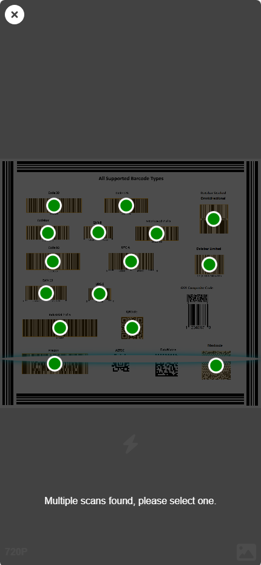

# Easy Barcode Scanner
A wrapper for dynamsoft-barcode-reader-javascript. Easier to use.

## Create your own scanner to gain more process control.
```html
<button id="btn-scan">scan</button>
<script src="https://cdn.jsdelivr.net/npm/dynamsoft-barcode-reader-bundle@10.2.1000/dist/dbr.bundle.js"></script>
<script src="https://cdn.jsdelivr.net/gh/Keillion/easy-barcode-scanner@10.2.1002/dist/easy-barcode-scanner.js" data-license=""></script>
<script>
  let pScanner, scanner;
  document.getElementById('btn-scan').addEventListener('click',async()=>{
    scanner = await (pScanner || (pScanner = EasyBarcodeScanner.createInstance()));
    scanner.onUniqueRead = (txt) => { console.log(txt); };
    await scanner.open();
  });
</script>
```

## One function directly scanning!
```html
<button id="btn-scan">scan</button>
<script src="https://cdn.jsdelivr.net/npm/dynamsoft-barcode-reader-bundle@10.2.1000/dist/dbr.bundle.js"></script>
<script src="https://cdn.jsdelivr.net/gh/Keillion/easy-barcode-scanner@10.2.1002/dist/easy-barcode-scanner.js" data-license=""></script>
<script>
  document.getElementById('btn-scan').addEventListener('click',async()=>{
    let txt = await EasyBarcodeScanner.scan();
    alert(txt);
  });
</script>
```


## Use in framework

```sh
npm i dynamsoft-barcode-reader-bundle@10.2.1000 -E
```

Copy `src/index.ts` to your project as `any-path/easy-barcode-reader.ts`.

dynamsoft.config.ts, you can import it in project entry, such as  `main.ts`.
```ts
import EasyBarcodeScanner from 'any-path/easy-barcode-reader';

EasyBarcodeScanner.license = "";
```

```ts
import EasyBarcodeScanner from 'any-path/easy-barcode-reader';

let pScanner = null;
let scanner = null;

async mount(){
    scanner = await (pScanner || (pScanner = EasyBarcodeScanner.createInstance()));
    scanner.onUniqueRead = (txt) => { console.log(txt); };
    await scanner.open();
}
beforeUnmount(){
    (await pScanner)?.dispose();
}
```

or
```ts
import EasyBarcodeScanner from 'any-path/easy-barcode-reader';

async scan(){
    alert(await EasyBarcodeScanner.scan());
}
```

## Customize the ui and the feature

```typescript
// use 'https://cdn.jsdelivr.net/npm/dynamsoft-camera-enhancer@4.0.3/dist/dce.ui.html' by default
EasyBarcodeScanner.createInstance(ui?: string|HTMLElement);
// use 'https://cdn.jsdelivr.net/gh/Keillion/easy-barcode-scanner@10.2.1002/dce.ui.html' by default
EasyBarcodeScanner.scan(ui?: string|HTMLElement);
```

The ui can be a url or a `HTMLElement`.

Please refer to [customize the ui for CameraEnhancer](https://www.dynamsoft.com/camera-enhancer/docs/web/programming/javascript/user-guide/index.html#customize-the-ui) for details.

You may also clone this repository and modify `src/index.ts` to suit your needs.
